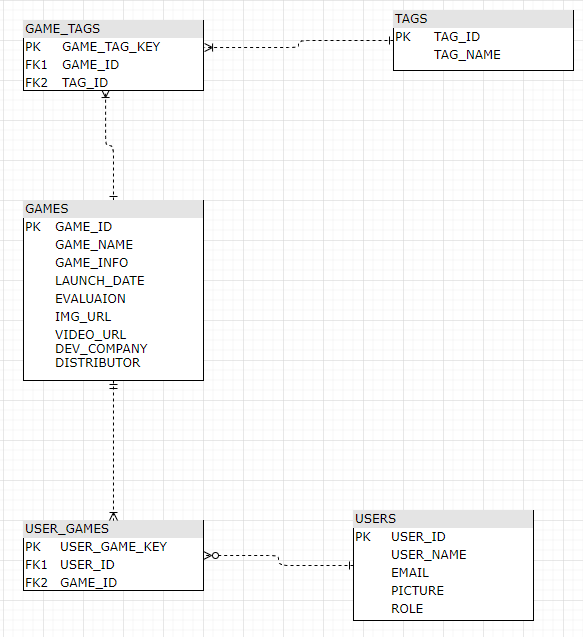
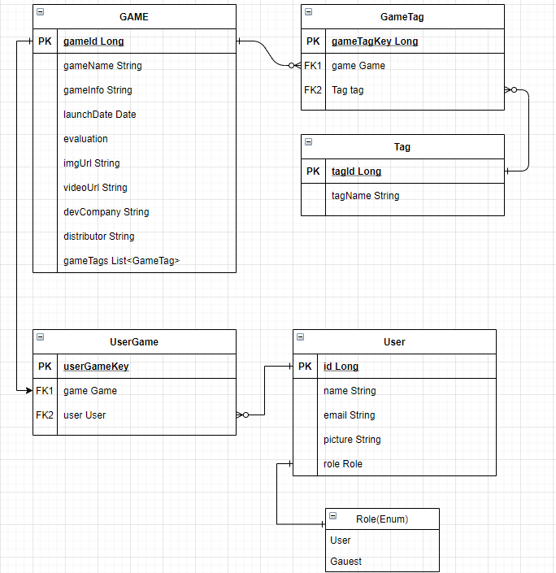
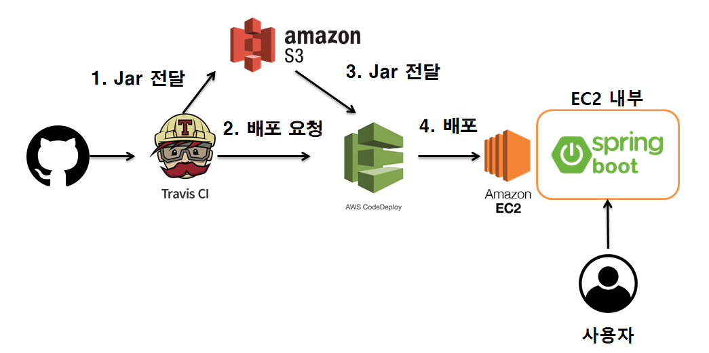
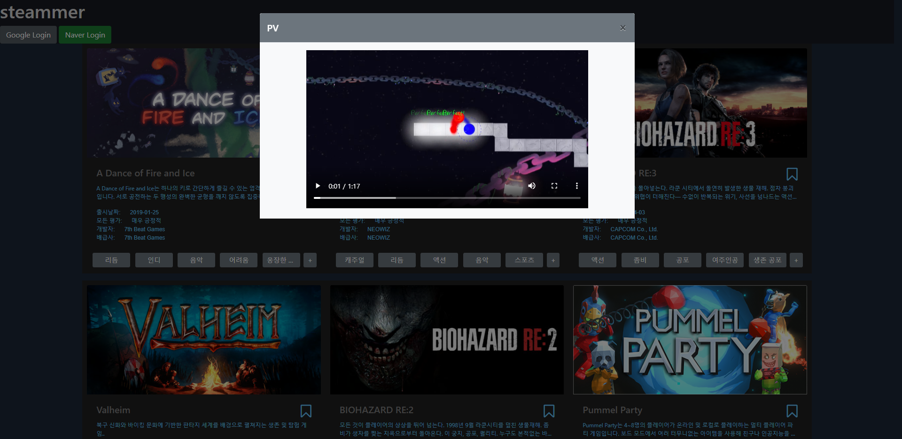
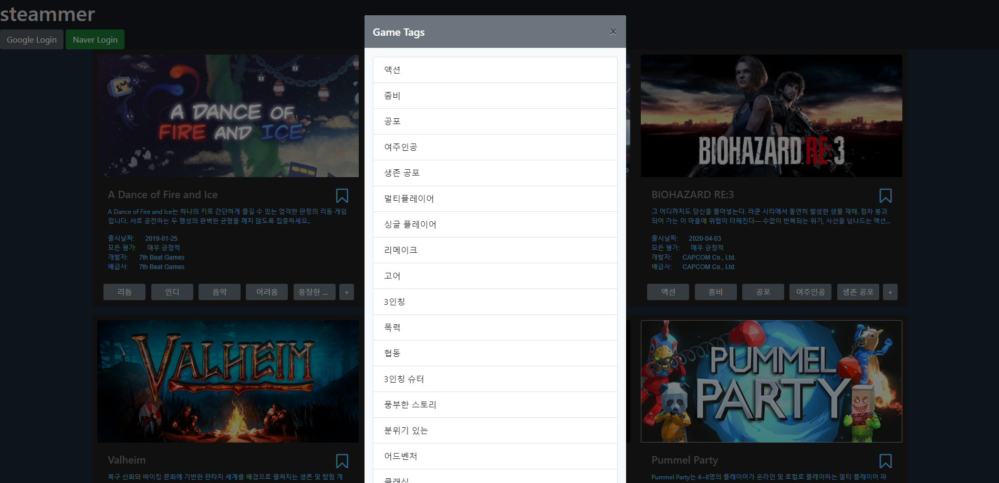

# steammer-webservice

스팀 웹페이지에서 크롤링한 데이터를 심플한 웹페이지 형태로 보여주는 웹 서비스.

# 사용기술
Spring Boot, Mustache, MySql, hibernate, spring security, travis

# features
 - steam 웹사이트 크롤링한 데이터 사용
 - 구글,네이버 로그인 연동
 - JPA를 통한 ORM 프로젝트

# 소개
- Database ERD

- Entity ERD

- 동작 구조

- 웹 페이지

